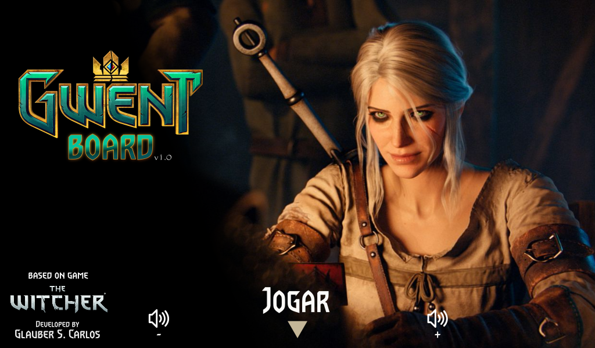
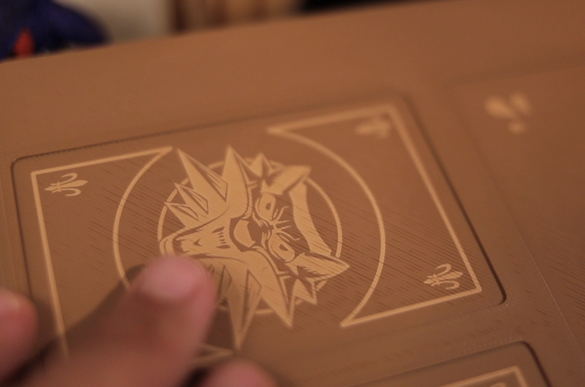
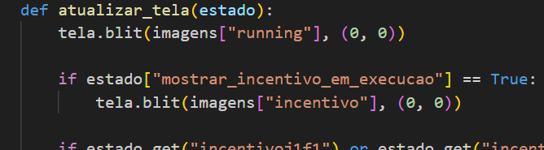
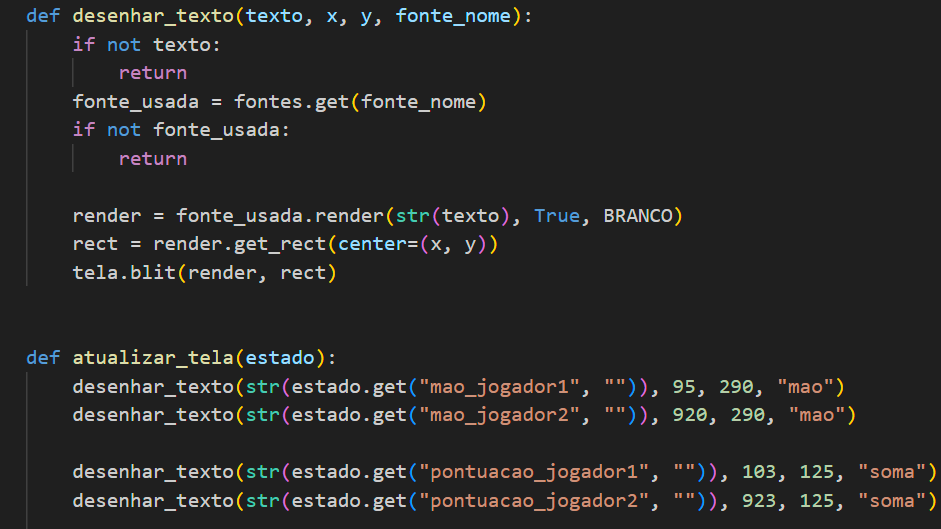
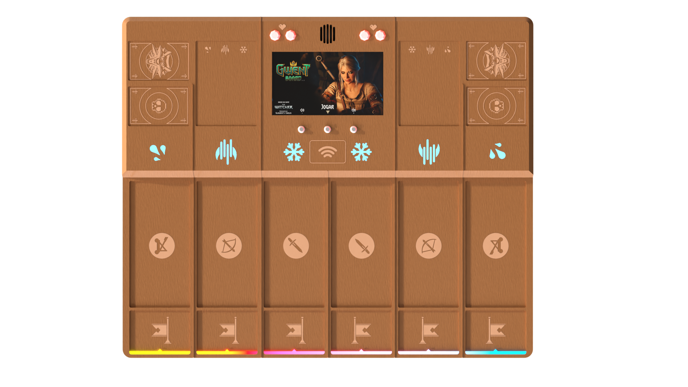
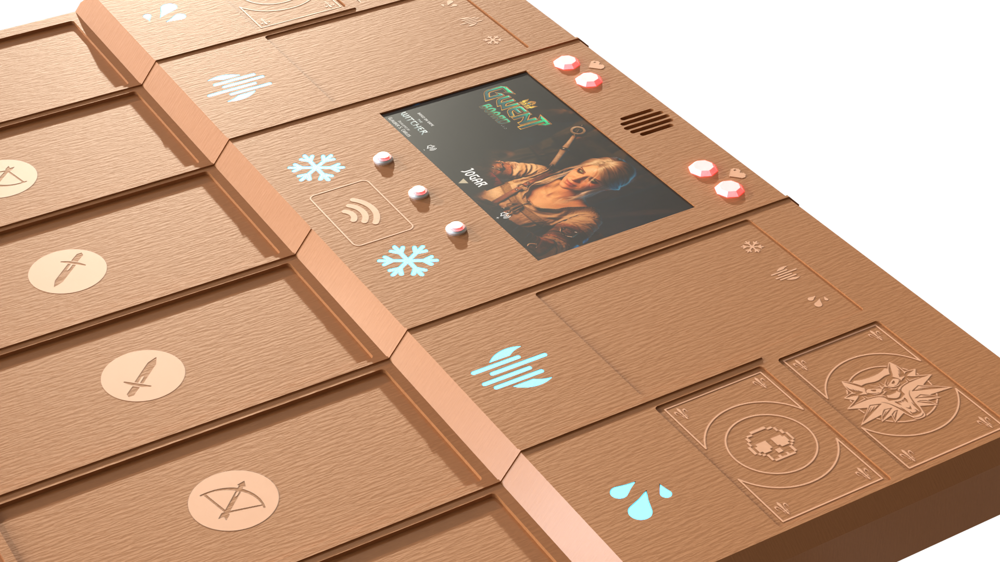

# 🧩 Projeto: Gwent Board
"Gwent Board" é o projeto de um tabuleiro para 2 jogadores que mistura interações físicas e digitais.
É baseado inteiramente no jogo Gwent, na sua versão presente em The Witcher 3 - Wild Hunt, com ligeiras modificações.

---

⚠️ Direitos

🚧 Gwent e The Witcher são marcas registradas, bem como suas artes, regras, músicas e quaisquer outras criações. 

🚧 O projeto não pode ser vendido e não possui fins lucrativos. O projeto "Gwent Board" é destinado ao aprendizado e diversão pessoal.

---

## 📝 Lista de peças

- Raspberry Pi 3 Model B
- Módulo NFC RC522
- Cartões NFC
- Módulo Amplificador de Áudio I2S MAX98357A
- Alto-falante 3w 4ohms
- LED WS2812B
- Switches NO com LED
- Display HDMI 7"
- Fonte de alimentação 5V 2.5A
- Cabos HDMI e USB
- Componentes eletrónicos (resistores, capacitores, fios, jumpers)

---

## 🧰 Programação

Python, os pacotes principais são: pygame, RPi.GPIO, rpi_ws281x, mfrc522.
.

---
## ⚙️ Processo de criação/construção

- Criei a lógica de programação e algoritmos, obtive auxílio do ChatGPT com a sintaxe Python, bem como a instalação das libs e interação com os pacotes e dispositivos.
- As orientações de eletrónica e ligações ao Raspberry pi foram dados pelo ChatGPT.
- As músicas em background são originais do jogo Gwent, versão "The Witcher 3 - Wild Hunt".
- Alguns efeitos sonoros são originais do jogo Gwent, outros são sons genéricos editados.
---
- O design 2D das cartas, impressão e adesivos;
- A organização das cartas em JSON;
- O design apresentado no display;
- O projeto do tabuleiro e a impressão em 3D;
- A gravação dos desenhos no tabuleiro.
  
Todos esses trabalhos foram feitos por mim.

| Design Cartas |
|------------------------|
| As cartas NFC são menores do que as artes originais |
| Facções foram adicionadas às cartas que não possuíam |
| Alguns efeitos ou fileiras foram alterados |
| Os textos foram traduzidos para português |
|  | 
|  | 

| Tabela de cartas do Excel |
|------------------------|
| Usado para organizar as características de cada carta |
|  |

| Design do Display (interface) |
|------------------------|
| Nomes das cartas, instruções, avisos, etc |
|  |

| Projeto 3D |
|------------------------|
| Impressos em impressora FDM |
|  |
|  |

| Gravações no tabuleiro |
|------------------------|
| Desenhos 2D feitos para gravar a peça à laser |
|  |

---

## ⚙️ Lógica de funcionamento

- A programação é dividida em módulos em python. 
- O módulo main.py é responsável pelo loop principal do jogo, enquanto os demais módulos executam ações adicionais ou controlam dispositivos eletrónicos.
- O arquivo JSON contém todos os dados das cartas.
  
| Diagrama de módulos |
|------------------------| 
|  |
- As setas duplas indicam que o módulo recebe e envia informações.
- Os módulos verdes possuem sua própria execução. O led_process.py é separado pois precisa de permissão especial.

Exemplos:

| graficos.py & interface.py |
|------------------------|
| Controlam o background, ícones, símbolos e todos os textos |
|  |
|  |

---
## 🎯 O jogo em si

As regras do jogo são similares ao do jogo Gwent original com algumas pequenas alterações. Há 2 funções de cartas ausentes.

Fluxo simplificado abaixo:

- Jogo por turnos. Cada carta jogada passa pelo sensor, que contabiliza a pontuação, realiza uma função específica ou aguarda alguma decisão do jogador.
- A carta jogada deverá ir para o local determinado, seja a fileira, espaço temporal ou lixo.
- A rodada acaba quando ambos os jogadores "passam a vez". O jogador sem cartas passa a vez automaticamente.
- Quem tiver maior pontuação vence a rodada.
- As cartas da mesa vão para o lixo.
- Inicia-se uma nova rodada com as cartas que sobraram nas mãos.
- Quem vencer mais rodadas (de 3), ganha o jogo.
  
---

## 🔍 Simulação de cartas no tabuleiro
| Carta "herói" junto com uma carta comum, na mesma fileira |
|------------------------| 
|  |

| Simulação da pontuação, caso fossem usadas a carta Sirene do Comandante e/ou Nevoeiro |
|------------------------| 
|  |

| Outras cartas com efeitos especiais que não podem ser usadas com a carta "herói" |
|------------------------| 
|  |

--- 

## ✨ O jogo possui lógicas de proteção para evitar erros e jogadas indevidas. 

- A leitura duplicada é protegida
- Não é possível repetir cartas do próprio jogador ou já usadas pelo adversário
- Não é possível jogar cartas não permitidas em um momento específico

## 🖼️ Imagens de conceito renderizadas

| Comentários Visuais |
|------------------------| 
| Antes de iniciar a rodada, os leds funcionam como um arco-íris |
| O arco-íris é ativado durante o jogo ao usar a carta de Incentivo na fileira desejada |
| A fileira com o efeito Nevoeiro, Nevasca ou Tempestade ativo fica com o led acesso em azul |
| Os 2 pares de leds acima do Display indicam a quantidade de vidas restantes de cada jogador |
| Os 3 botões abaixo do Display são utilizados para ações específicas e possuem leds indicadores |
|  |
|  |

## Imagens e Vídeos reais
.
<iframe width="560" height="315" src="https://www.youtube.com/embed/_kUl0WX-bwk?si=IDS91_LsGSfpiGRR" title="YouTube video player" frameborder="0" allow="accelerometer; autoplay; clipboard-write; encrypted-media; gyroscope; picture-in-picture; web-share" referrerpolicy="strict-origin-when-cross-origin" allowfullscreen></iframe>
.
|  |

🚧 🧭 ... Em atualização ...

## Próximos passos.

- Desenvolvimento da versão GWENT LITE, com a mesma jogabilidade e uso de cartas NFC.
- A versão LITE funcionará com o smartphone e não possuirá tabuleiro físico.

💡 🖼️ 📌 🌐 🛠️ ✅ 🚧 📬 👤 ℹ️ 🧭 📱 🖨️ 🚀 

